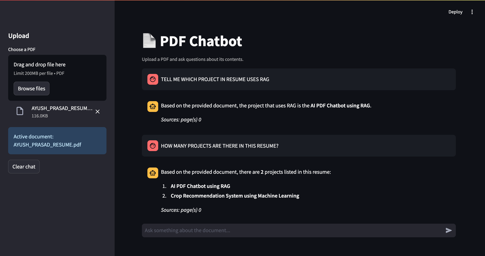

# 📄 AI PDF Chatbot (RAG)

A chatbot that lets you **upload any PDF and ask questions about it**, powered by Retrieval-Augmented Generation (RAG). Instead of relying on a language model's general knowledge, this project retrieves the most relevant parts of *your* document and uses them to generate accurate, grounded answers — with page numbers cited.

---

## 🚀 What This Project Does

Large language models are great at answering general questions, but they can't read your private documents and often "hallucinate" facts. This project solves that by combining:

- **Document retrieval** – finding the exact chunks of text relevant to a question
- **Generative AI (Google Gemini)** – turning those chunks into a clear, natural-language answer

The result: a chat interface where you can drop in a PDF (a research paper, report, contract, textbook, etc.) and get accurate answers sourced directly from that document.

---

## 📸 Demo



*Example: a resume PDF is uploaded, and the chatbot correctly answers questions like "Number of projects in resume?" by pulling the actual project names straight from the document.*

---

## 🧠 How It Works

The pipeline follows a classic RAG architecture:

```
PDF Upload → Chunking → Embedding → Vector Search → Prompt Building → LLM Answer
```

| Step | File | What Happens |
|------|------|--------------|
| **1. Ingestion** | `pdf_processor.py` | The PDF is loaded page by page and split into overlapping ~1000-character chunks, so no context is lost across chunk boundaries. |
| **2. Embedding + Indexing** | `vector_store.py` | Each chunk is converted into a vector using Gemini's embedding model and stored in a **FAISS** index for fast similarity search. |
| **3. Retrieval + Generation** | `chatbot.py` | When a question is asked, the top-k most relevant chunks are retrieved from FAISS, inserted into a prompt template, and sent to Gemini to generate a grounded answer. |
| **4. User Interface** | `app.py` | A **Streamlit** chat interface where users upload a PDF and ask questions, with page numbers cited alongside each answer. |

---

## 🛠️ Tech Stack

- **Python**
- **Streamlit** – web-based chat UI
- **FAISS** – vector similarity search
- **Google Gemini API** – embeddings + answer generation

---

## ⚙️ Setup

1. Clone the repository:
   ```
   git clone https://github.com/ayushprasad5/AI-PDF-CHATBOT-USING-RAG.git
   cd AI-PDF-CHATBOT-USING-RAG
   ```

2. Install dependencies:
   ```
   pip install -r requirements.txt
   ```

3. Add your Gemini API key. Copy `.env.example` to `.env` and add:
   ```
   GOOGLE_API_KEY=your_key_here
   ```
   (Get a free key from [Google AI Studio](https://aistudio.google.com/app/apikey))

---

## ▶️ Run the App

```
streamlit run app.py
```

Then open the local URL Streamlit gives you, upload a PDF from the sidebar, and start asking questions in the chat box.

---

## 📂 Project Structure

```
AI-PDF-CHATBOT-USING-RAG/
├── app.py            # Streamlit UI - upload PDF & chat
├── chatbot.py         # Retrieval + prompt building + Gemini answer generation
├── pdf_processor.py   # PDF loading & chunking logic
├── vector_store.py    # Embedding generation & FAISS indexing
├── requirements.txt   # Python dependencies
└── README.md
```

---

## 💡 Key Highlights (for recruiters / reviewers)

- Implements a full **end-to-end RAG pipeline** from scratch — chunking, embedding, vector search, and grounded generation.
- Uses **FAISS**, an industry-standard vector database, for efficient semantic search.
- Integrates with **Google Gemini** for both embeddings and answer generation.
- Includes **source citation** (page numbers) so answers are verifiable, not just plausible-sounding text.
- Clean separation of concerns across modules (ingestion, indexing, retrieval/generation, UI) — easy to extend or swap components.

---

## 🔭 Possible Improvements

- **Persist the FAISS index** using `save_index()` / `load_index()` in `vector_store.py`, so the same PDF doesn't need to be re-embedded on every run.
- **Tune chunk size/overlap per document type** — dense academic PDFs and sparse slide-style PDFs behave differently.
- **Add conversation memory** so follow-up questions can reference earlier turns in the chat.

---

## 📜 License

This project is open source and available for anyone to learn from or build on.
